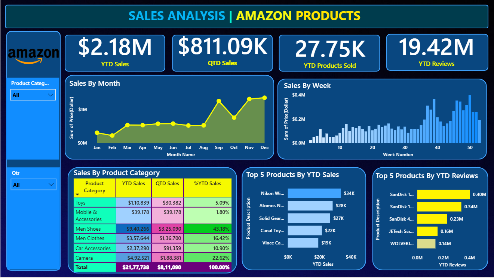

# Amazon Product Sales Analysis Dashboard

## Overview
This Power BI dashboard provides comprehensive analysis of Amazon product sales data, offering insights into sales trends, product performance, and customer behavior.

## Features
- Sales performance tracking
- Product category analysis
- Customer segmentation
- Regional sales distribution
- Time-based trend analysis
- Key performance indicators (KPIs)

## Dashboard Screenshots
### Main Dashboard View

*Main dashboard showing overall sales metrics and KPIs*

### Category Analysis View 

*Detailed product performance and category analysis*

### Quantitative Sales View

## Top Selling Products View

## Tools Used
- Power BI Desktop
- Microsoft Excel (for data preparation)
- DAX (for calculations)

## Key Insights
- Visualize total sales trends over time
- Track top-performing product categories
- Monitor customer purchasing patterns
- Analyze regional sales distribution
- Identify seasonal trends and patterns

## How to Use
1. Download the Power BI file (.pbix)
2. Open with Power BI Desktop
3. Refresh data if needed
4. Interact with the visualizations to filter and analyze data

## Data Sources
- Amazon sales data
- Product catalog
- Customer information
- Regional sales records

## Requirements
- Power BI Desktop (latest version recommended)
- Windows 8.1/Windows Server 2012 R2 or later
- Internet connectivity for data refresh

## Contributing
Feel free to fork this repository and submit pull requests for any improvements.

## License
This project is licensed under the MIT License - see the LICENSE file for details.

## Author
Created by [Sarvesh Vengurlekar](https://github.com/sarveshvengurlekar)

## Acknowledgments
- Thanks to Power BI community for visualization inspiration
- Gratitude to all contributors and data providers
